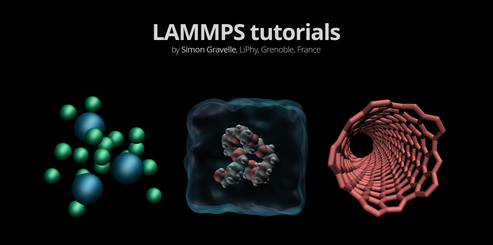

# Solutions to the LAMMPS tutorials exercices

Those are the solutions to all the exercises found on [lammpstutorials](https://lammpstutorials.github.io/).

  

Feel free to contact me if you notice something missing or inconsistent using simon.gravelle@live.fr
