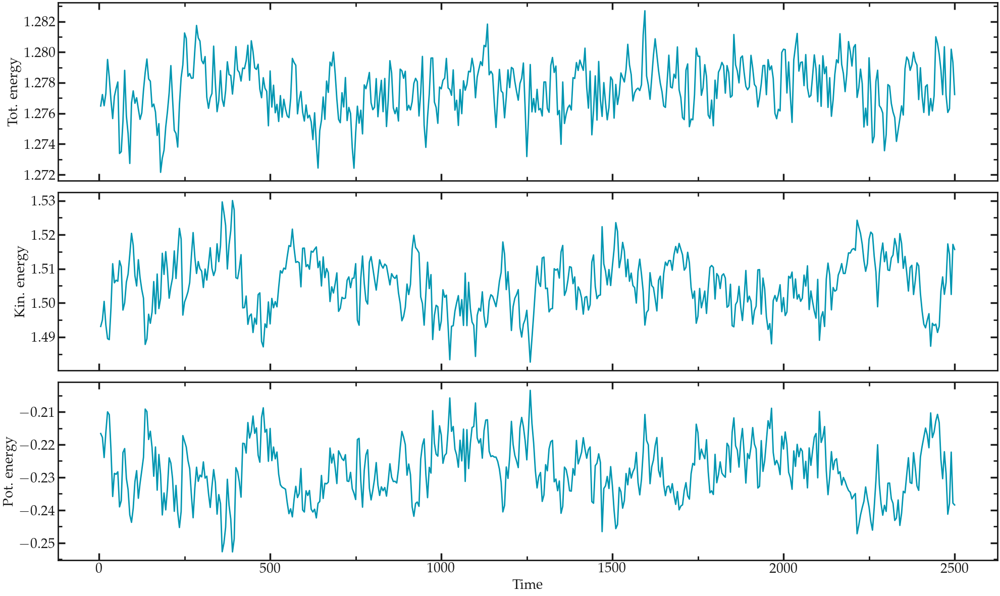

# Lennard Jones fluid

## A simulation with no thermostat

1) It is important to first bring the system to a proper temperature by running a
small NVT simulation, which is done here with the [first input](./simulation-with-no-thermostat/input.a.lammps).

2) Then, start the NVE simulation from the equilibrated configuration
Note that the equilibrated configuration contains the atoms velocities, i.e. it contains the temperature.

No thermostat such as temp/berendsen or langevin is used. For the atom positions to be updated following Newton's law, the fix nve must be kept.

It can sometimes be better to reduce the timestep when using NVE system, as it gives better energy conservation?

The total energy of the system can be extracted using the internal LAMMPS variable etotal, see the [second input](./simulation-with-no-thermostat/input.b.lammps).

## Do without the ‘minimize’ command

### Preamble : on the importance of energy minimisation

With the currnt system, we can
explore what happens if we don't perform a minimisation step
and start the molecular dynamics directly. To do so, comment
the two following lines:

..  code-block:: lammps

    # thermo 10
    # minimize  1.0e-4 1.0e-6 1000 10000

If you run LAMMPS again, you should get something like:

..  code-block:: bw

    Step Temp E_pair E_mol TotEng Press
    0 5.8997404e+14 0 5.8997404e+14 1.5732641e+15
    ERROR: Lost atoms: original 1600 current 272 (src/thermo.cpp:438)
    Last command: run 10000

The message indicates that LAMMPS lost
some of the atoms, then stopped. This is one of the most
common error message that you will see. It is usually the
consequence of badly constructed system or inappropriate
dynamics. In the present case, atoms are too close to each
others initially, so the forces are huge, leading to
enormous acceleration. As a consequence, atoms are moving by
large distances during the firsts timesteps, and LAMMPS
loses them.

## Non-equilibrium simulation

## Dumbbell molecules
