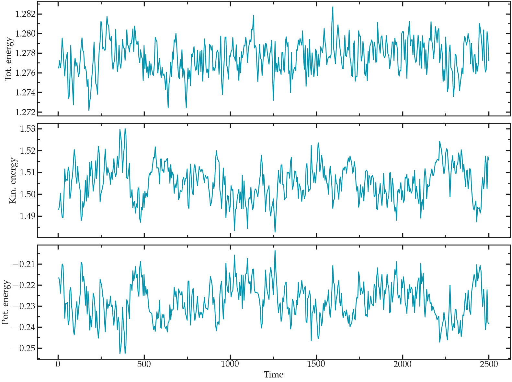

# Lennard Jones fluid

## A simulation with no thermostat

1) It is important to first bring the system to a proper temperature by running a
small NVT simulation, which is done here with the [first input](./simulation-with-no-thermostat/input.a.lammps).

2) Then, start the NVE simulation from the equilibrated configuration
Note that the equilibrated configuration contains the atoms velocities, i.e. it contains the temperature.

No thermostat such as temp/berendsen or langevin is used. For the atom positions to be updated following Newton's law, the fix nve must be kept.

It can sometimes be better to reduce the timestep when using NVE system, as it gives better energy conservation?

The total energy of the system can be extracted using the internal LAMMPS variable etotal, see the [second input](./simulation-with-no-thermostat/input.b.lammps).

<p float="left">
<a href="">
  </a>
</p>

## Do without the ‘minimize’ command

### Preamble : on the importance of energy minimization

With the current system, we can
explore what happens if we don't perform a minimization step
and start the molecular dynamics directly. To do so, comment
the two following lines:

```
    # thermo 10
    # minimize  1.0e-4 1.0e-6 1000 10000
```

If you run LAMMPS again, you should get something like:

```
    Step Temp E_pair E_mol TotEng Press
    0 5.8997404e+14 0 5.8997404e+14 1.5732641e+15
    ERROR: Lost atoms: original 1600 current 272 (src/thermo.cpp:438)
    Last command: run 10000
```

The message indicates that LAMMPS lost
some of the atoms, then stopped. This is one of the most
common error message that you will see. It is usually the
consequence of badly constructed system or inappropriate
dynamics. In the present case, atoms are too close to each
others initially, so the forces are huge, leading to
enormous acceleration. As a consequence, atoms are moving by
large distances during the firsts timesteps, and LAMMPS loses them.

### Possible solution

Here I propose to replace the minimize command with the
fix nve/limit and a Langevin thermostat. The command nve/limit
limits the motion of the atom to a certain value. The idea is to
prevent strong motion of the atoms initially.

See the [input](./do-without-the-minimize-command/input.lammps).

A second "run" with relaxed constraint is performed to further
bring the system toward a more acceptable state. 

## Non-equilibrium simulation

The fix addforce command with an added force of 0.05 (no units)
is used to induce the motion of the atoms, see the
[input](./non-equilibrium-simulation/input.lammps).

The velocity of the particle in the direction x can be extracted using
the variable vcm. As can be seen in the velocity_vs_time.dat file, 
the average velocity quickly reaches 0.005 (unitless).

To make sure that the forcing does not bring the system in the 
non-linear response regime, which is expected at very large forcing,
one must always test different values for the force and ensure that 
the average velocity scales linearly with the force.

## Dumbbell molecules

The first important step, when creating molecules, is to generate 
molecule templates. Here, two templates were created for both 
molecules types, see [here](./create-dumbell-shaped-molecule/dumbell1.mol)
and [here](./create-dumbell-shaped-molecule/dumbell2.mol). Its important to
keep those files consistent with the LAMMPS documentation. Here, each molecules
constraints 2 atoms, linked by one single bond.

In the [input](./create-dumbell-shaped-molecule/input.lammps) file, the atom_style
was changed to molecular, which allows atoms to be linked by bonds. The bond-style
harmonic was chosen.

When creating the box, it is important to add the commands bond/types and extra/bond/per/atom
in order to allocate memory space for the bonds. Molecules templates can be imported
with the molecule command, and used in combination with the create_atoms command 
to insert molecules in the box. 

The last important step is to define the bonds properties using the 
bond_coeff. 